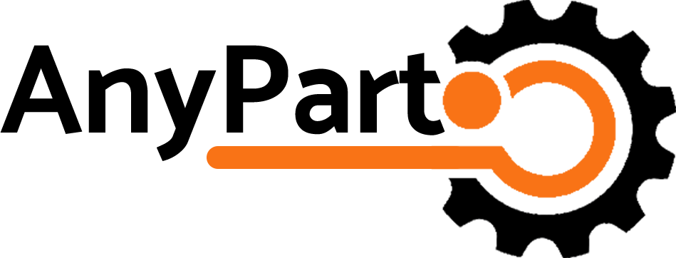

<!-- PROJECT LOGO -->
 

  

  

   
    Automotive parts comparison 
    Gather price information from multiple suppliers and car lots to compare and find the best deals on used and new car parts

<!-- ABOUT THE PROJECT -->
## About The Project

The system will allow users (private/garages) to input the desired replacement parts, and field owners/importers will be able to submit price proposals for the parts. This way, the customer focuses their activities in one place and receives the most suitable deal for them.

### Built With

* [![React][React.js]][React-url]
* 
* 
* 
* 

<!-- GETTING STARTED -->
## System Tasks
1. Retrieving Data from the Vehicle Registry Office Database (Government Api).
3. SSE (Server Sent Events).
4. User Registration (Regular/Supplier).
5. Creating Orders.
6. Displaying Personal Profiles According to User Type.
7. Viewing Orders and Price Proposals for Each Order (Regular User).
8. Viewing All Orders from All Users (Supplier).
9. Sent offers to all the users orders.
10. Receiving Notifications on Order Status.
  
<!-- ROADMAP -->
## Roadmap

- [x] Characterization the system - Understanding the struct of the the system before start coding.
- [x] Database - Developing a robust and efficient database. 
- [x] Bulding UI & API - Start bulding the website based on the Characterization we make in the first step.
- [x] QA - Running relevant system tests and fixing bugs.

<!-- CONTACT -->
## Contact

Asif Asido - [LinkedIn](www.linkedin.com/in/asif-asido) - asidoasif@gmail.com

Project Link: [Any Part](https://anypart.netlify.app/)

[React.js]: https://img.shields.io/badge/React-20232A?style=for-the-badge&logo=react&logoColor=61DAFB
[React-url]: https://reactjs.org/
